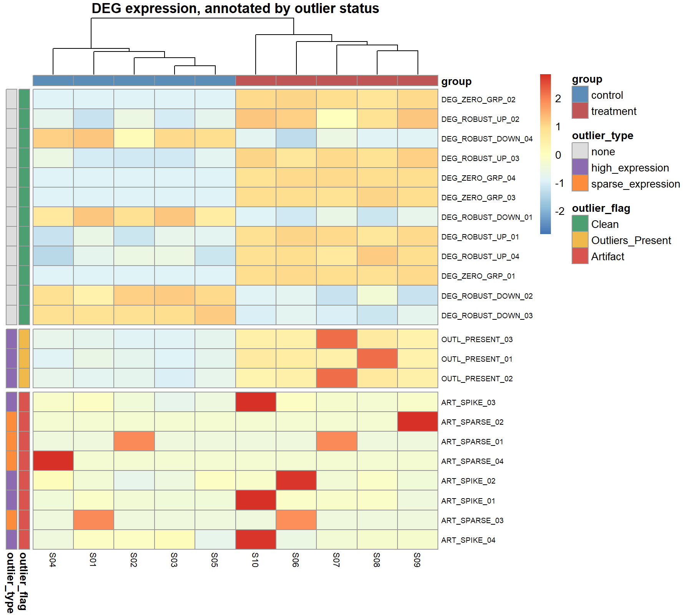

# Post-DESeq2 outlier and artifact annotation for small-n RNA-seq

[](https://www.r-project.org/)
[](https://opensource.org/licenses/MIT)

A post-hoc annotation tool for differential expression results from DESeq2
(or edgeR / limma-voom). It does **not** re-run the test. It takes the table
of significant genes, the library-size-normalised count matrix, and the
sample sheet, and for each significant DEG asks whether the call is
supported by a group-level expression pattern or by a small number of
samples whose behaviour is incompatible with a group-level inference.

Each DEG receives one of three labels:

| Flag | Meaning |
|---|---|
| **Clean** | Expression difference is consistent across samples of each group. |
| **Outliers_Present** | One or more samples are extreme, but the group-level pattern is still coherent. |
| **Artifact** | The DEG call is attributable to a single or few samples, or to expression confined to a handful of samples overall. |

The caller decides what to do with those labels. The tool itself never
drops genes.


## Why this step exists

DESeq2 and edgeR model gene-wise counts with a negative binomial GLM and
use information-sharing across genes (dispersion shrinkage, Cook's-distance
outlier flagging) to stabilise estimates in small experiments. These
safeguards are powerful but not exhaustive. Two situations recur in
small-n studies (typically four to six biological replicates per group,
common for RNA-seq from individual animals or manually microdissected
tissue) in which the statistical model can return a significant p-value
even though the underlying expression pattern does not represent a
group-level regulatory difference:

1. **One biological replicate carries an extreme value** that pulls the
   group mean far from the other replicates in that group. The fitted
   log-fold-change is real in the arithmetic sense, but it is not a
   property of the group. Remove that single sample and the difference
   evaporates. With five replicates per group, one extreme sample is
   20% of the group.

2. **A gene is expressed in only a handful of samples across the entire
   contrast.** In the extreme, one or two samples have non-zero counts
   and the rest are at zero. DESeq2 can still return a small padj after
   dispersion shrinkage borrows information from higher-count genes,
   but within-group variance is essentially undefined for a gene
   expressed in so few samples, and the DEG call cannot speak to a
   regulated response.

DESeq2's built-in Cook's-distance machinery (outlier replacement and
Cook's-based p-value filtering) partly addresses case 1, but both
behaviours are tied to sample size by design. Outlier replacement
requires at least seven replicates per group, and Cook's-based filtering
of individual p-values is not applied when the smaller group has three
or fewer samples, which is the regime most at risk. Case 2 is not
addressed by Cook's distance at all, because it is a property of the
full expression vector across samples and not of a single large residual.

The script annotates both situations explicitly.

**Design note on genes expressed in only one group:** A gene with zero
counts in all samples of one group but consistent, high expression in
all samples of the other group is a biologically valid signal
(complete induction from a silent baseline). This script retains such
genes as Clean, because rule 2 (sparse expression) only fires when
fewer than three samples express the gene across the entire contrast,
a gene expressed in all five replicates of the treatment group has five
non-zero observations and passes comfortably. Genes whose non-zero
signal is confined to one or two samples regardless of group membership
are a different matter and are flagged as Artifact under rule 2.

**Relevant methodology references:**
PMID 33709073, PMID 40926263, PMID 25516281, PMID 39478636.


## Contents

```
DEGs_filtering_GitHub_v2/
├── DEGs_outlier_detection_postDeSeq.R    # main annotation script
├── plot_outlier_heatmap.R                # diagnostic heatmap helper
├── example_run.R                         # end-to-end demo
├── example_data/
│   ├── generate_example_data.R           # reproducible synthetic dataset
│   ├── example_normalized_counts.tsv
│   ├── example_results.tsv
│   ├── example_samplesheet.tsv
│   ├── example_annotated_results.tsv     # produced by example_run.R
│   └── example_heatmap.png               # produced by example_run.R
└── README.md
```


## Installation

```r
install.packages(c("dplyr", "pheatmap"))
```

No Bioconductor packages are required for annotation itself. DESeq2 is
only needed upstream to produce the inputs.


## Quick start

```r
source("DEGs_outlier_detection_postDeSeq.R")

res <- analyze_differentialabundance_outliers(
  results_file           = "deseq2.results.tsv",
  normalized_counts_file = "deseq2.normalised_counts.tsv",
  sample_sheet_file      = "samplesheet.tsv"
)

# Full annotated results table
head(res$comprehensive_results)

# Flag counts
res$summary
```

To see which samples drive each flagged gene, use the optional heatmap
helper:

```r
source("plot_outlier_heatmap.R")

plot_outlier_heatmap(
  annotation             = res,
  normalized_counts_file = "deseq2.normalised_counts.tsv",
  sample_sheet_file      = "samplesheet.tsv",
  output_file            = "deg_heatmap.png"
)
```


## Inputs

| File | Description | Format |
|---|---|---|
| Results table | DESeq2 or edgeR output | TSV with a `padj` (or `adj.P.Val`) column and ideally `log2FoldChange` (or `logFC`). Row names or first column are gene IDs. |
| Normalized counts | Library-size normalised matrix | TSV. Rows are genes, columns are samples. |
| Sample sheet | Sample metadata | TSV with one row per sample. Must contain a sample identifier column (`sample_id`, or `sample`, or the first column) and a contrast-group column (`condition`, `group`, `treatment`, and so on, otherwise the second column is used). |

The script reads nf-core/differentialabundance outputs without modification
(`deseq2.results.tsv`, `deseq2.normalised_counts.tsv` and the original
`samplesheet.csv/tsv`).


## Algorithm

For every significant DEG the script runs two annotation rules. A gene
can be flagged by both.

### Rule 1. Single-sample outlier detection

For each DEG the full vector of normalized counts across samples is
examined with four criteria:

* the ratio to the sample median, which catches moderate spikes in
  otherwise balanced vectors.
* a fallback based on the ratio to the sample mean when the median is
  zero, needed when many samples do not express the gene.
* the ratio to the smallest non-zero value, which catches patterns in
  which most samples sit just above the detection floor and one sample
  is orders of magnitude higher.
* a robust IQR test, which flags values well above the third quartile
  of the distribution of the remaining samples.

A sample that departs from the rest of the distribution under any of
these criteria is called an outlier. A gene is flagged as **Artifact**
when the outlier sample or samples are confined to a single contrast
group and are either extreme in absolute expression or extreme relative
to the non-outlier samples of that same group, such that removing them
would render the two groups indistinguishable at the group level. If
outliers exist but the group-level pattern remains coherent, that is,
the non-outlier samples of each group still separate, the gene is
flagged as **Outliers_Present** and retained.

The criteria are heuristic and magnitude-aware. A simple percentile-based
cut would be too aggressive on small samples, where any RNA-seq vector
has an empirical extremum. Biological differences in bulk transcriptomics
typically fall within roughly one order of magnitude between groups and
are preserved. The rule is tuned to act on departures that are
substantially larger, of the order of one to three orders of magnitude
above the remaining samples, which in practice is the pattern most
frequently associated with technical artefacts such as PCR jackpotting,
mis-mapping, or contamination.

### Rule 2. Sparse expression

Independently of rule 1, any DEG expressed (non-zero counts) in fewer
than `min_expressing_samples` across the entire contrast is flagged as
**Artifact** with type `sparse_expression`. The default is three.

The rationale is statistical rather than purely about outliers. A gene
with non-zero counts in fewer than three samples provides essentially no
within-group variance information, because for at least one of the two
groups the variance is being estimated from a single non-zero observation
or none. The negative-binomial dispersion estimator is still formally
defined, but under small-n designs dispersion shrinkage pulls such genes
toward the prior and can yield standard errors that are small relative
to the observed effect even though the effect itself rests on one or two
data points. A contrast-level difference supported by a single expressing
sample in a single group is not separable from individual-level variation
or from a single mis-labelled or contaminated library, and the script is
conservative about treating it as evidence of a group response.

Note that rule 2 does **not** fire on genes that are expressed in all
replicates of one group and zero in the other, because in that case the
total number of expressing samples equals the group size and easily
exceeds the `min_expressing_samples` threshold. Such genes (complete
induction or complete repression) are biologically coherent signals and
are retained as Clean, with the per-group expression distribution
visible in the annotated output.

The two rules are evaluated in order (1, then 2), and rule 2 can
overwrite an earlier Clean call to Artifact when the global expression
count warrants it. A gene that passes both rules is labelled **Clean**,
or **Outliers_Present** if rule 1 detected outliers without triggering
an Artifact call.


## Output

The return value is a list with three elements.

### `comprehensive_results`

The original results table, with the following columns appended:

| Column | Description |
|---|---|
| `outlier_flag` | One of `Clean`, `Outliers_Present`, `Artifact`. |
| `likely_artifact` | Boolean, `TRUE` if `outlier_flag == "Artifact"`. |
| `has_outliers` | `TRUE` if any rule flagged the gene. |
| `outlier_type` | `high_expression`, `low_expression`, `moderate`, or `sparse_expression`. |
| `outlier_samples` | Samples implicated by the rule that fired (semicolon-separated). |
| `outlier_values` | Their normalized counts. |
| `non_outlier_range` | Range of the non-outlier samples (for rule 1). |
| `group_pattern` | Distribution of outliers (rule 1) or total expressing-sample count (rule 2). |

### `outlier_flags`

Subset of `comprehensive_results` restricted to genes that triggered any
rule, for manual inspection.

### `summary`

A named list with `total_degs`, `clean_degs`, `outliers_present`,
`likely_artifacts`, and `degs_with_flags`.


## Parameters

| Parameter | Default | Description |
|---|---:|---|
| `padj_threshold` | `0.05` | Adjusted-p-value threshold used to select the DEGs that enter the annotation. |
| `min_samples_consistent` | `2` | Minimum number of non-outlier samples required in each group for rule 1 to flag a gene as Artifact. Prevents flagging when too few non-outlier samples remain to judge the group-level pattern. |
| `min_expressing_samples` | `3` | Minimum number of samples with non-zero counts across the contrast for a gene to pass rule 2. |


## Worked example

A synthetic dataset is shipped under `example_data/` and can be
regenerated with `generate_example_data.R`. It contains 41 genes and 10
samples (two groups of five) covering:

* 8 robust DEGs (consistent fold change up or down), expected **Clean**.
* 4 zero-in-one-group DEGs: all control replicates are zero, all treatment
  replicates express the gene at high and consistent levels (complete
  induction from a silent baseline), expected **Clean**.
* 3 Outliers_Present: one treatment replicate is ~8x the group median,
  the remaining four replicates still separate from control, expected
  **Outliers_Present**.
* 4 spike artifacts: one treatment replicate carries 14,000–27,000
  normalised counts while the rest of the contrast sits near zero,
  expected **Artifact** (rule 1).
* 4 sparse_expression artifacts: expressed in only 1–2 samples total,
  expected **Artifact** (rule 2).
* 18 non-DEG background genes (padj > 0.05, not annotated).

Run the demo with:

```bash
Rscript example_run.R
```

Expected summary:

```
total_degs        : 23
clean_degs        : 12     # 8 robust + 4 zero-in-one-group DEGs
outliers_present  :  3
likely_artifacts  :  8     # 4 spike + 4 sparse
```

The accompanying heatmap (saved to `example_data/example_heatmap.png`)
shows all 23 annotated DEGs ordered by flag and clustered by column,
with left-hand annotation bars indicating flag status and artifact
subtype:



The top block (green, Clean) shows both the robust fold-change DEGs and
the zero-in-one-group genes: all control samples have low or zero counts
while all treatment samples are consistently elevated, a coherent
biological signal. The middle block (yellow, Outliers_Present) shows
genes where one treatment sample is markedly elevated above its peers
but the remaining replicates still separate from control. The bottom
block (red, Artifact) contains spike artifacts (one saturated cell per
row) and sparse-expression artifacts (one or two lone expressing cells
per row, scattered across groups).

The zero-in-one-group Clean genes illustrate the key design decision of
this script: a gene that is zero in all control replicates but high and
consistent across all treatment replicates reflects a real transcriptional
change, not a stochastic dropout artefact. Flagging it as Artifact would
be scientifically incorrect. Rule 2 correctly passes it because the total
number of expressing samples (five) meets the `min_expressing_samples`
threshold. Compare this to the sparse-expression Artifacts, where only
one or two samples across the entire contrast are non-zero: there the
signal is indistinguishable from individual-level noise.


## Integration with nf-core/differentialabundance

```bash
nextflow run nf-core/differentialabundance -r 1.5.0 \
    -profile singularity \
    --input samplesheet.csv \
    --matrix gene_counts_length_scaled.tsv \
    --contrasts contrasts.csv \
    --outdir results/
```

```r
source("DEGs_outlier_detection_postDeSeq.R")

res <- analyze_differentialabundance_outliers(
  results_file           = "results/deseq2/condition_treatment_vs_control/deseq2.condition_treatment_vs_control.results.tsv",
  normalized_counts_file = "results/deseq2/normalised_counts/deseq2.normalised_counts.tsv",
  sample_sheet_file      = "samplesheet.csv"
)
```


## Integration with a standard DESeq2 workflow

```r
library(DESeq2)
dds <- DESeq(dds)
res <- results(dds)

write.table(as.data.frame(res),
            "deseq2_results.tsv", sep = "\t", quote = FALSE)
write.table(counts(dds, normalized = TRUE),
            "normalized_counts.tsv", sep = "\t", quote = FALSE)

source("DEGs_outlier_detection_postDeSeq.R")
annot <- analyze_differentialabundance_outliers(
  results_file           = "deseq2_results.tsv",
  normalized_counts_file = "normalized_counts.tsv",
  sample_sheet_file      = "sample_metadata.tsv"
)
```


## Scope and caveats

* The script is designed for small-n bulk RNA-seq experiments (roughly
  three to eight samples per group). Larger designs tend to handle the
  situations above natively through DESeq2's own outlier machinery.
* It operates on count-based library-size-normalised expression.
  Log-transformed or variance-stabilised abundances (VST, rlog, CPM, TPM)
  are not on the same scale as counts, so rule 1's absolute-magnitude
  criteria should be interpreted relatively when applied to those inputs.
* The rules are conservative with respect to biological variation.
  Moderate group differences, bimodal group distributions produced by
  real heterogeneity, and consistent minor-allele-like patterns are
  preserved as Clean or Outliers_Present.
* Annotations are a starting point for review. Genes flagged in a
  study-critical contrast should be inspected individually. The
  `outlier_samples` and `group_pattern` fields, together with the
  heatmap, make that inspection fast.


## Citation

If you use this script, please cite this repository together with the
methodology references listed above (PMIDs 33709073, 40926263, 25516281,
39478636).


## License

MIT License.
